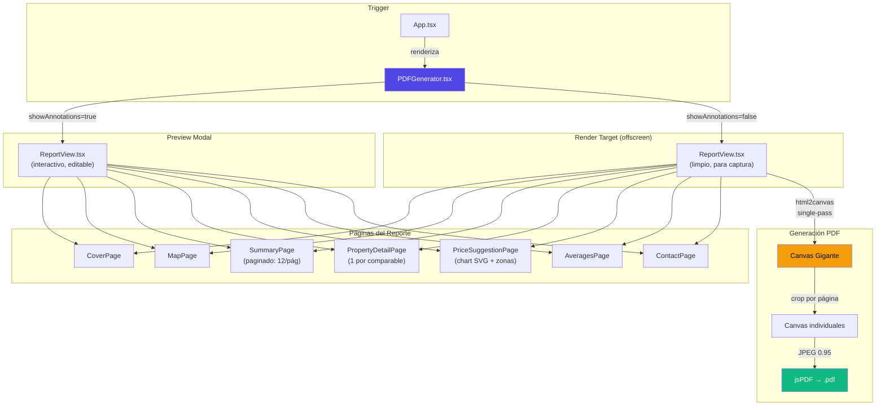

# 🔍 Análisis del Generador de PDF — InmoTasador

## Arquitectura General



| Archivo | Tamaño | Responsabilidad |
|---------|--------|-----------------|
| [`PDFGenerator.tsx`](file:///c:/Users/Gabriel/Desktop/01_Proyectos_Activos/Inmo-Tasador/src/components/PDFGenerator.tsx) | 17KB | Controlador principal: modal preview, edición inline, generación con html2canvas → jsPDF |
| [`ReportView.tsx`](file:///c:/Users/Gabriel/Desktop/01_Proyectos_Activos/Inmo-Tasador/src/components/ReportView.tsx) | 12KB | Ensamblador de páginas + `AnnotatedPage` (escalado responsivo + panel de edición) |
| [`CoverPage.tsx`](file:///c:/Users/Gabriel/Desktop/01_Proyectos_Activos/Inmo-Tasador/src/components/report/CoverPage.tsx) | Portada con logo, dirección, foto destacada, datos del corredor |
| [`MapPage.tsx`](file:///c:/Users/Gabriel/Desktop/01_Proyectos_Activos/Inmo-Tasador/src/components/report/MapPage.tsx) | Mapa estático + pines SVG de comparables |
| [`SummaryPage.tsx`](file:///c:/Users/Gabriel/Desktop/01_Proyectos_Activos/Inmo-Tasador/src/components/report/SummaryPage.tsx) | Tabla resumen (chunks de 12 props por página) |
| [`PropertyDetailPage.tsx`](file:///c:/Users/Gabriel/Desktop/01_Proyectos_Activos/Inmo-Tasador/src/components/report/PropertyDetailPage.tsx) | 20KB | Ficha detallada por comparable (imágenes, precios, características, chips SVG) |
| [`PriceSuggestionPage.tsx`](file:///c:/Users/Gabriel/Desktop/01_Proyectos_Activos/Inmo-Tasador/src/components/report/PriceSuggestionPage.tsx) | 20KB | Valores sugeridos + gráfico de barras SVG + tabla de zonas |
| [`AveragesPage.tsx`](file:///c:/Users/Gabriel/Desktop/01_Proyectos_Activos/Inmo-Tasador/src/components/report/AveragesPage.tsx) | Promedios de mercado + conclusión editable |
| [`ContactPage.tsx`](file:///c:/Users/Gabriel/Desktop/01_Proyectos_Activos/Inmo-Tasador/src/components/report/ContactPage.tsx) | Página de cierre con datos institucionales + aviso legal |

**Librerías**: `jspdf` v4.2.0, `html2canvas` v1.4.1, `html-to-image` v1.11.13 (esta última no se usa activamente)

---

## 🐛 FALLOS Y BUGS

### CRÍTICOS

#### 1. Dependencia `html-to-image` sin uso — peso muerto
**Archivo**: [`package.json:21`](file:///c:/Users/Gabriel/Desktop/01_Proyectos_Activos/Inmo-Tasador/package.json#L21)

`html-to-image` está en dependencies pero **no se importa en ningún lado**. Es peso muerto que suma al bundle. Hay un comentario en `PDFGenerator.tsx` que dice:

> *"Revert back to html2canvas for 100% compatibility... This prevents black pages due to SVG viewport conflicts in html-to-image"*

Es decir, se probó `html-to-image`, falló con SVGs, y se volvió a `html2canvas` — pero nunca se limpió la dependencia.

> [!WARNING]
> **Acción**: Eliminar `html-to-image` de `package.json`.

---

#### 2. El CSS `crossorigin` como atributo CSS es INVÁLIDO
**Archivo**: [`index.css:59-61`](file:///c:/Users/Gabriel/Desktop/01_Proyectos_Activos/Inmo-Tasador/src/index.css#L59-L61)

```css
/* Ensure images use CORS for html2canvas */
img {
    crossorigin: "anonymous";
}
```

`crossorigin` NO es una propiedad CSS — es un atributo HTML. Esta regla **no hace absolutamente nada**. La protección CORS real viene de los `crossOrigin="anonymous"` hardcodeados en cada `` de los componentes React.

> [!CAUTION]
> **Impacto**: Ninguno funcional (ya se pone el atributo en JSX), pero es código muerto que da una falsa sensación de seguridad. Si alguien remueve el `crossOrigin` de algún `` pensando que el CSS lo cubre, las imágenes se capturarán en negro.

---

#### 3. Tipado `any` generalizado — bomba de tiempo
**Archivos**: Todos los componentes de reporte

El `PDFGenerator` recibe `data: any` y propaga `any` a TODO el árbol. Esto significa:

- No hay autocompletado ni detección de errores en tiempo de desarrollo
- Un refactor en `SavedValuation` rompe el PDF silenciosamente (sin error de compilación)
- La función `resolveData()` hace malabares con `data || valuation || {}` porque no tiene tipos que la guíen

```tsx
// Actual
data: any; // SavedValuation ← ¡el tipo correcto está EN UN COMENTARIO!

// Debería ser
data: SavedValuation;
```

> [!WARNING]
> **Impacto**: Cualquier cambio en la estructura de datos puede romper el PDF sin que TypeScript lo detecte.

---

#### 4. `getSafeImageUrl` agrega cache-buster que rompe CORS en algunos CDNs
**Archivo**: [`image.ts:7-8`](file:///c:/Users/Gabriel/Desktop/01_Proyectos_Activos/Inmo-Tasador/src/utils/image.ts#L7-L8)

```ts
const separator = url.includes('?') ? '&' : '?';
imageCache.set(url, `${url}${separator}c=${Date.now()}`);
```

El `c=Date.now()` funciona para cacheo, **pero** hay CDNs y configuraciones de Firebase Storage donde agregar query params no listados en los CORS headers causa que el navegador trate la URL como un recurso diferente y falle el CORS preflight. Además, si el componente se re-renderiza, `Date.now()` genera una URL nueva cada vez que se llama fuera del cache.

> [!WARNING]
> **Impacto**: Puede causar imágenes en negro en el PDF en algunos entornos. El `imageCache` con `Map` mitiga parcialmente, pero si el módulo se recarga (HMR), se pierde el cache.

---

#### 5. No hay manejo de error cuando `container` se mueve y la captura falla
**Archivo**: [`PDFGenerator.tsx`](file:///c:/Users/Gabriel/Desktop/01_Proyectos_Activos/Inmo-Tasador/src/components/PDFGenerator.tsx) — `handleGeneratePDF`

Si `html2canvas` falla (timeout, CORS, memoria), el `container.style.visibility` y `container.style.left` **no se restauran** porque el `catch` no incluye la restauración. El container queda visible en `left: 0px` detrás de todo.

```tsx
// El catch NO restaura el container:
} catch (err) {
    console.error("Error generating PDF", err);
    alert("Hubo un error al generar el PDF.");
    // ⚠️ container.style.visibility y .left nunca se restauran
}
```

> [!CAUTION]
> **Impacto**: Si la generación falla, queda un bloque invisible/visible flotando en `left: 0` que puede causar layout shifts o contenido fantasma.

---

#### 6. La fecha del reporte es `new Date()` — no la fecha de la tasación
**Archivos**: [`CoverPage.tsx`](file:///c:/Users/Gabriel/Desktop/01_Proyectos_Activos/Inmo-Tasador/src/components/report/CoverPage.tsx), [`AveragesPage.tsx`](file:///c:/Users/Gabriel/Desktop/01_Proyectos_Activos/Inmo-Tasador/src/components/report/AveragesPage.tsx), [`SummaryPage.tsx`](file:///c:/Users/Gabriel/Desktop/01_Proyectos_Activos/Inmo-Tasador/src/components/report/SummaryPage.tsx)

Todas las páginas usan `new Date()` para mostrar la fecha. Si el usuario exporta un PDF de una tasación vieja (por ej. de hace 3 meses), la fecha que aparece es la de HOY, no la de cuando se hizo la tasación. Esto es incorrecto para un documento profesional.

> [!IMPORTANT]
> La `SavedValuation` tiene un campo `date: number` (timestamp). Debería usarse ese.

---

### MODERADOS

#### 7. Canvas gigante puede crashear en mobile
El approach de "single-pass render" crea un canvas de `794px × (1123px × N_páginas)` escalado a `2x`. Para un reporte de 20 comparables (≈25 páginas):

$$\text{Canvas} = 1588 \times 28075 = 44{,}583{,}100 \text{ pixels} \approx 178 \text{ MB en RAM}$$

iOS Safari tiene un límite de ~16 millones de pixels por canvas. **Un reporte de ~7+ páginas puede fallar silenciosamente en iPhone**, devolviendo un canvas negro.

> [!CAUTION]
> **Impacto**: En iPhone con muchos comparables, el PDF sale completamente negro o la pestaña se crashea.

---

#### 8. `editableReportData` depende de `JSON.parse(JSON.stringify())` para deep clone
**Archivo**: [`PDFGenerator.tsx`](file:///c:/Users/Gabriel/Desktop/01_Proyectos_Activos/Inmo-Tasador/src/components/PDFGenerator.tsx)

```tsx
setEditableReportData({
    target: JSON.parse(JSON.stringify(resolvedData.target)),
    ...JSON.parse(JSON.stringify(resolvedData.valuation))
});
```

Esto rompe:
- `Date` objects → se convierten en strings
- `undefined` values → se eliminan
- `NaN` / `Infinity` → se convierten en `null`

En este caso probablemente no haya Dates (son timestamps number), pero es un patrón frágil.

---

#### 9. El `useEffect` de `editableReportData` tiene dependencias incompletas
**Archivo**: [`PDFGenerator.tsx`](file:///c:/Users/Gabriel/Desktop/01_Proyectos_Activos/Inmo-Tasador/src/components/PDFGenerator.tsx)

```tsx
useEffect(() => {
    if (showPreview && tipo === 'tasacion' && resolvedData) { ... }
}, [showPreview, tipo, data, target, comparables, valuation]);
// ⚠️ Falta: corredorName, matricula, clientName
```

Si `corredorName` cambia sin que `data` cambie, `editableReportData` no se actualiza.

---

#### 10. `ContactPage` no tiene `pageNumber`
**Archivo**: [`ContactPage.tsx`](file:///c:/Users/Gabriel/Desktop/01_Proyectos_Activos/Inmo-Tasador/src/components/report/ContactPage.tsx)

Es la única página que no muestra número de página en el footer. Inconsistencia visual con el resto del reporte.

---

## 🔧 MEJORAS

### Arquitectura y Código

| # | Mejora | Impacto | Esfuerzo |
|---|--------|---------|----------|
| 1 | **Tipar todo el pipeline**: Reemplazar `data: any` con `SavedValuation`, crear interfaces para las props de cada página | Eliminación de bugs silenciosos, DX | Medio |
| 2 | **Extraer la lógica de generación PDF a un service/hook**: `usePDFGenerator()` o `pdfService.ts` separando la generación del componente React | SRP, testeable, reutilizable | Medio |
| 3 | **Implementar chunked rendering en vez de single-pass**: Renderizar de a 3-5 páginas por batch para evitar el límite de canvas en mobile | Compatibilidad mobile | Alto |
| 4 | **Restaurar container en `finally`**: Mover la restauración de `visibility` y `left` al bloque `finally` | Robustez | Bajo |
| 5 | **Eliminar `html-to-image`** del `package.json` | Bundle size | Trivial |
| 6 | **Eliminar la regla CSS inválida** de `crossorigin` | Limpieza | Trivial |
| 7 | **Usar `structuredClone()` en vez de `JSON.parse(JSON.stringify())`** | Correctitud | Bajo |
| 8 | **Usar la fecha real de la tasación** (`data.date`) en vez de `new Date()` | Correctitud profesional | Bajo |
| 9 | **Agregar loading skeleton/progress** durante la generación (actualmente solo dice "Generando...") | UX | Bajo |

### Rendimiento

| # | Mejora | Detalle |
|---|--------|---------|
| 1 | **Web Worker para la generación PDF** | Mover el crop de canvas + inserción en jsPDF a un Worker para no bloquear el main thread |
| 2 | **Lazy loading de páginas del reporte** | Las páginas se renderizan TODAS de entrada. Con `React.lazy` + `Suspense` se podría cargar bajo demanda en el preview |
| 3 | **Reducir scale a 1.5** en mobile | El `captureScale: 2` es overkill para pantallas mobile. Detectar dispositivo y ajustar |
| 4 | **Compresión en jsPDF** | Actualmente `compress: false`. Para reportes grandes (>15 páginas) el PDF puede pesar >30MB. Activar compresión selectivamente |

### Calidad del PDF

| # | Mejora | Detalle |
|---|--------|---------|
| 1 | **Metadata del PDF** | Agregar `pdf.setProperties({ title, author, subject, creator })` para SEO y profesionalismo |
| 2 | **Outline/bookmarks** | jsPDF soporta bookmarks. Agregar: Portada, Mapa, Resumen, Comparables, Valoración, Conclusión |
| 3 | **Nombre de archivo inteligente** | Actualmente `tasacion-{address}.pdf`. Sanitizar la dirección (quitar caracteres especiales) y agregar fecha |

---

## 🚀 NUEVAS FUNCIONALIDADES

### Alta Prioridad (Alto valor para el usuario)

#### 1. Exportar a múltiples formatos
- **PDF con texto seleccionable**: Migrar de html2canvas (rasterizado) a una solución basada en `@react-pdf/renderer` para generar PDFs con texto real, no imágenes. Esto permitiría copiar/pegar texto del PDF.
- **Exportar como imágenes** (PNG por página): Para compartir por WhatsApp, que es el canal principal en el mercado inmobiliario argentino.

#### 2. Plantillas de reporte
Permitir al usuario elegir entre diferentes diseños de reporte:
- **Clásico** (actual)
- **Minimalista** (menos decoración, más datos)
- **Ejecutivo** (1-2 páginas de resumen, sin fichas individuales)
- **Completo** (todas las páginas + anexos)

#### 3. Compartir por link (sin descargar)
Generar un link temporal (Firebase Storage + Cloud Functions) que permita al cliente ver el reporte en el navegador sin descargar nada. Útil para compartir por WhatsApp/email.

#### 4. Marca de agua para borradores
Agregar una marca de agua diagonal "BORRADOR" configurable para reportes preliminares que el corredor no quiere que se distribuyan como finales.

### Media Prioridad

#### 5. Página de fotos adicionales
Si un comparable tiene >3 imágenes, se pierden. Agregar una página de "Galería Fotográfica" que muestre todas las imágenes en grid (4×3 o similar).

#### 6. Historial de versiones del PDF
Guardar cada PDF generado en Firebase Storage con metadata (quién lo generó, cuándo, qué cambios se hicieron en el editor inline). Permitir re-descargar versiones anteriores.

#### 7. Página de comparativa lado a lado
Una página de comparación visual donde se ponen 2-3 propiedades comparables lado a lado con métricas clave para facilitar la comprensión del cliente.

#### 8. Disclaimers configurables por tenant
El aviso legal está hardcodeado. Debería ser configurable desde la configuración del tenant, ya que cada inmobiliaria puede tener requerimientos legales diferentes.

### Baja Prioridad (Nice to have)

#### 9. Vista previa en tiempo real (split view)
En vez de un modal, tener una vista dividida donde a la izquierda están los controles de edición y a la derecha se ve el reporte actualizar en tiempo real, estilo editor WYSIWYG.

#### 10. Gráficos adicionales en el reporte
- **Gráfico de dispersión** precio vs. superficie
- **Timeline** de días en mercado por comparable
- **Mapa de calor** de precios por zona (requiere datos geográficos más ricos)

#### 11. Exportar datos a Excel/CSV
Complementar el PDF con un archivo de datos tabulares (Excel) que el corredor pueda usar para sus propios análisis.

---

## Resumen Ejecutivo

| Categoría | Cantidad | Severidad predominante |
|-----------|----------|----------------------|
| Bugs Críticos | 6 | 🔴 3 críticos, 3 importantes |
| Bugs Moderados | 4 | 🟡 |
| Mejoras de código | 9 | 🟢 Mayormente bajo esfuerzo |
| Mejoras de rendimiento | 4 | 🟡 Medio esfuerzo |
| Mejoras de calidad PDF | 3 | 🟢 Bajo esfuerzo |
| Nuevas funcionalidades | 11 | 🔵 Variable |

> [!IMPORTANT]
> **Las 3 cosas que haría PRIMERO:**
> 1. ⚡ Mover la restauración del container al `finally` (5 min, previene bugs visuales)
> 2. 🏗️ Tipar el pipeline completo eliminando `any` (previene bugs futuros)
> 3. 📱 Implementar chunked rendering (previene crasheos en mobile)
