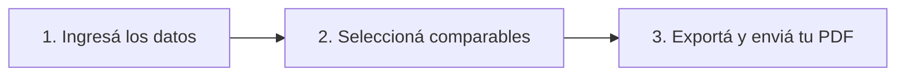

# Content Script & Copywriting: Landing Page - Tasador Inmobiliario Digital

> **Propósito:** Copia lista para usar en la web del **Tasador Inmobiliario Digital**. Diseñada con estructuras de copywriting de alta conversión (AIDA + PAS) orientada a martilleros, tasadores y agencias inmobiliarias.

---

## 1. HEADER & HERO SECTION (La Primera Impresión)

### Badge Superior
`🚀 La herramienta #1 para Martilleros y Agentes Inmobiliarios Modernos`

### H1 (Titular Principal)
# Creá Reportes de Tasación Profesionales en Minutos, No en Horas.

### Subtítulo (Propuesta de Valor)
Dejá de perder tiempo diseñando en Word o armando planillas complejas. Automatizá tus informes con mapas geolocalizados, análisis de comparables y exportación PDF impecable lista para mandar por WhatsApp.

### Botones de Acción (CTA)
- **CTA Primario:** `[ Empezar Prueba Gratuita ]`
- **CTA Secundario:** `[ Ver Reporte de Ejemplo (PDF) ]`

### Social Proof Inicial
- ⭐⭐⭐⭐⭐ *+500 inmobiliarias ya profesionalizaron sus tasaciones.*
- ⏱️ *Tiempo promedio de armado: 5 minutos.*

---

## 2. SECCIÓN EL PROBLEMA vs. LA SOLUCIÓN (PAS: Problem, Agitate, Solve)

### El Dolor Actual (¿Te suena familiar?)
- ❌ **Horas perdidas copiando y pegando:** Pasás más tiempo formateando cuadros y pegando imágenes en Word que analizando el mercado.
- ❌ **Informes poco profesionales:** Reportes planos que no transmiten el verdadero valor de tu trabajo ni la autoridad de tu marca.
- ❌ **Direcciones y datos desordenados:** Errores manuales en ubicaciones, sin mapas interactivos claros para el cliente.
- ❌ **Historial disperso:** Archivos perdidos en carpetas de la computadora sin centralizar tus comparables históricos.

### La Solución: Tasador Inmobiliario Digital
> *"La forma inteligente, rápida y moderna de captar propiedades mostrando autoridad desde el primer contacto."*

---

## 3. BENEFICIOS CLAVE (Features que generan ventas)

### 📊 1. Automatización de Informes PDF Premium
Generá documentos PDF con un diseño limpio, elegante y estandarizado. Incluye carátula, datos técnicos, análisis de precios y resumen ejecutivo sin tocar un solo botón de diseño.

### 📍 2. Mapas Automáticos con Geolocalización (Google Places)
Autocompletá direcciones al instante sin errores de tipeo. El sistema genera automáticamente mapas de alta resolución con marcadores claros que ubican la propiedad tasada y sus comparables.

### 🔍 3. Gestión y Selección de Comparables
Ingresá y compará propiedades del mercado de forma estructurada. El sistema calcula valores por m² y homogeneiza variables para fundamentar tu precio con precisión científica.

### 📱 4. Envío Inmediato por WhatsApp y Nube
Compartí el reporte final en un clic. Enviá el PDF directamente por WhatsApp a tu cliente o guardalo en Google Drive para mantener a todo tu equipo sincronizado.

### 🗄️ 5. Historial Centralizado de Tasaciones
Buscá y consultá todas las tasaciones realizadas en tu zona. Creá tu propia base de datos de mercado para presupuestar más rápido y con mayor respaldo histórico.

---

## 4. CÓMO FUNCIONA (Proceso en 3 Pasos)

1. **Ingresá la Propiedad:** Completá los datos básicos con autocompletado inteligente de dirección y fotos.
2. **Ajustá los Comparables:** Agregá los inmuebles de referencia y dejá que el sistema arme el mapa de ubicación.
3. **Generá y Compartí:** Hacé clic en "Exportar PDF" y enviáselo al propietario por WhatsApp al instante.

---

## 5. TABLA COMPARATIVA (El Impacto Real en tu Negocio)

| Característica | Método Tradicional (Word/Excel) | Con Tasador Inmobiliario Digital |
| :--- | :---: | :---: |
| **Tiempo por informe** | 2 a 4 horas | **Menos de 10 minutos** |
| **Diseño y Estética** | Básico / Desalineado | **PDF Premium Estandarizado** |
| **Ubicación y Mapas** | Capturas de pantalla borrosas | **Mapas HD geolocalizados** |
| **Envío al Cliente** | Email manual pesado | **1-Clic vía WhatsApp / Drive** |
| **Base de Datos** | Archivos sueltos en el disco | **Historial centralizado y buscable** |

---

## 6. PRUEBA SOCIAL / TESTIMONIOS

> 💬 **"Antes tardaba toda la tarde en armar una carpeta para presentar al propietario. Ahora salgo de la visita, cargo los datos y en 10 minutos le mando un PDF impecable por WhatsApp. Capté un 40% más de propiedades este mes."**
> — *Martín R., Corredor Inmobiliario en CABA*

> 💬 **"El mapa interactivo con los comparables le da una transparencia al cliente que elimina cualquier discusión de precio. Es la mejor inversión que hicimos en la oficina."**
> — *Laura G., Directora de Inmobiliaria*

---

## 7. PLANES Y PRECIOS (Pricing Table)

### Plan Independiente / Martillero
- **Precio:** $X / mes
- Ideal para agentes independientes que buscan profesionalizarse.
- Incluye:
  - Hasta 30 tasaciones/mes
  - Exportación ilimitada a PDF
  - Mapas integrados de Google Places
  - Soporte por WhatsApp

### Plan Inmobiliaria / Equipo (MÁS POPULAR) ⭐
- **Precio:** $XX / mes
- Para oficinas inmobiliarias con múltiples agentes.
- Incluye:
  - Tasaciones **ILIMITADAS**
  - Personalización con Logo y Colores de la Inmobiliaria
  - Integración con Google Drive corporativo
  - Base de datos compartida entre agentes
  - Soporte prioritario 24/7

---

## 8. PREGUNTAS FRECUENTES (FAQ)

#### ¿Necesito instalar algún programa en mi computadora?
No. La plataforma es 100% web. Podés acceder desde tu computadora, notebook o tablet desde cualquier lugar.

#### ¿Puedo agregar el logo de mi inmobiliaria en los reportes?
¡Totalmente! Los informes se generan con tu marca, logo y datos de contacto para potenciar tu identidad corporativa.

#### ¿Cómo se generan los mapas de comparables?
Utilizamos la API oficial de Google Places. Solo tenés que ingresar la dirección y el sistema geolocaliza automáticamente la propiedad y sus comparables en un mapa de alta definición.

#### ¿Puedo probar la herramienta antes de contratar?
Sí, ofrecemos una prueba gratuita para que crees tus primeros informes y compruebes el salto de calidad en tu trabajo.

---

## 9. FOOTER & CTA FINAL (Cierre de Alta Conversión)

### Titular Final
## Eleva la calidad de tus tasaciones hoy mismo.
Sumate a los profesionales que están cerrando más captaciones con reportes que deslumbran a los propietarios.

### Botón de Cierre
- `[ Probar Gratis Ahora ]`

---
*Documento generado para el proyecto Tasador Inmobiliario Digital.*
